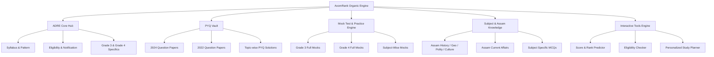

# AxomRank — Keyword & Intent Strategy

## 1. Executive Summary
The AxomRank organic growth strategy targets search intent across the entire aspirant lifecycle in Assam—from top-of-funnel exam announcements to high-intent commercial queries for mock tests, previous year papers, and performance analytics.

## 2. Topic Clusters & Hierarchy

## 3. Prioritization Matrix Formula
Keywords are prioritized using the formula:
$$\text{Priority Score} = \text{Search Volume Weight} \times 0.3 + \text{Relevance} \times 0.3 + \text{Intent Commercial Value} \times 0.3 + (1 - \text{Competition}) \times 0.1$$

- **P0 (Critical)**: High intent, high conversion, foundational exam hubs (`/adre/`, `/adre/mock-test/`, `/adre/syllabus/`, `/adre/previous-year-question-paper/`, `/tools/score-calculator/`).
- **P1 (High)**: High volume, topic specific (`/assam-gk/`, `/adre/grade-3/`, `/adre/grade-4/`, `/tools/eligibility-checker/`).
- **P2 (Supporting)**: Deep long-tail topics, specific sub-cultural topics, sub-domain quizzes.

## 4. Intent & Content Type Mapping
- **Informational Intent**: Evergreen guides, syllabus breakdown, Assam GK notes.
- **Transactional / Commercial Intent**: Free mock test landing pages, interactive PYQ solvers, rank predictors.
- **Micro-Interaction Intent**: Interactive 5-minute quizzes, instant eligibility calculators.

## 5. Scalable Programmatic Rule Set
1. **Never create thin/duplicate pages**: Programmatic pages must render interactive components (e.g. quiz engine, dynamic stats, interactive solutions) alongside unique localized text.
2. **Canonical enforcement**: Every route strictly enforces canonical tags without parameter pollution.
3. **Structured Data**: Automatic JSON-LD injection for `Course`, `Quiz`, `Exam`, `BreadcrumbList`, and `WebApplication`.
